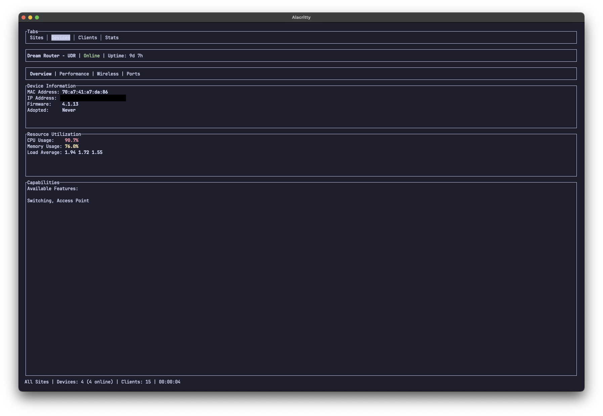

# unifi-tui

[](https://crates.io/crates/unifi-tui)
[](LICENSE)


A terminal user interface (TUI) using the [unifi-rs](https://crates.io/crates/unifi-rs) library for the UniFi Network API.

Currently, a work in progress. Intend to add more features as the unifi-rs library gets more features. 


## Usage
```shell
unifi-tui --url {url} --api-key {api-key} --insecure
```

Or with environment variables
```shell
export UNIFI_URL={url}
export UNIFI_API_KEY={api-key}

unifi-tui
```

## Features
- View sites
  - Select a site to limit the devices and clients to that site
- View devices
  - View device overview
  - View device network throughput, granular to 5 second updates. Don't want to kill your controller with too many requests 
  - View device ports and port status
  - View device radios
- View clients
  - View client overview with Name, IP, MAC, device it is connected to, wired/wireless, uptime and status
  - View client information with client information and the upstream device information
- View stats
  - View general stats for the site
  - All site summary with device count, client count (wired/wireless), network throughput.
  - Device status with device name, CPU usage, memory usage, and network throughput
  - Client history graph with client count over time (wired/wireless)
  - Network throughput graph with network throughput over time

## Installation
```shell
cargo install unifi-tui
```

Or download the binary from the [releases](https://github.com/CallumTeesdale/unifi-tui/releases) page. Haven't got cross working with arm macs yet so no mac binaries yet.

## Roadmap
Don't have one yet. Will add more features as the unifi-rs library gets more features which is whenever unifi api gets more features 
available.


## Screenshots
### Sites


### Unifi Devices




### Clients


### Stats
