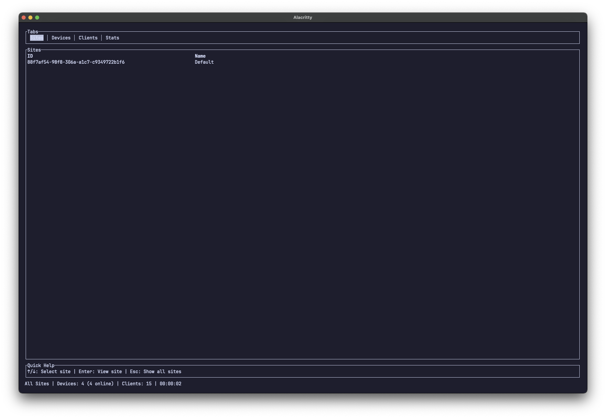
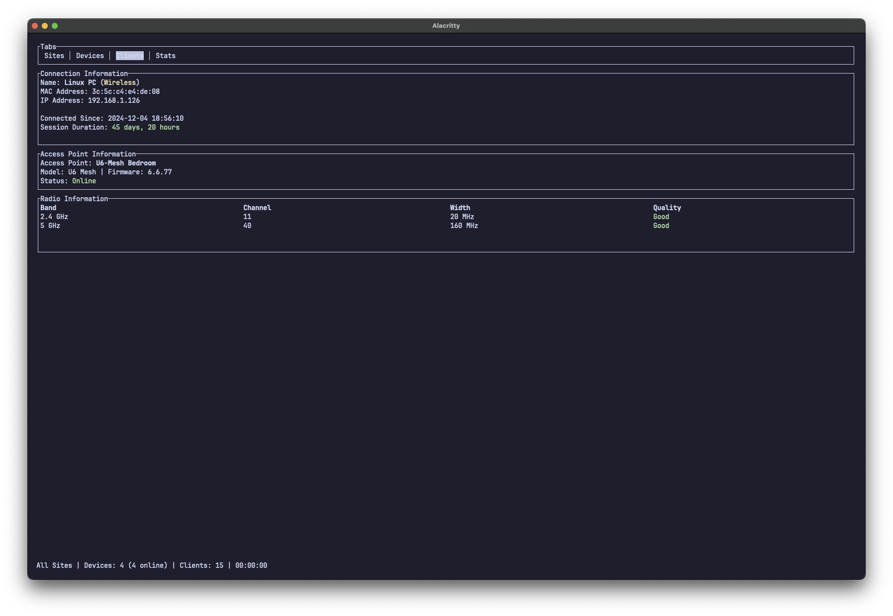

# unifi-tui

[](https://crates.io/crates/unifi-tui)
[](LICENSE)


A terminal interface for your UniFi network, powered by [unifi-rs](https://crates.io/crates/unifi-rs).

## Why?
Sometimes you just want to check on your network without leaving the terminal. This tool makes it easy to monitor devices, track clients, and view network stats - all from the comfort of your command line.

## Getting Started
With CLI arguments:
```shell
unifi-tui --url {url} --api-key {api-key} --insecure
```

Or with environment variables:
```shell
export UNIFI_URL={url}
export UNIFI_API_KEY={api-key}
```

## What Can It Do?
### Network Management

- Switch between sites and get site-specific views
- See your network topology with connected devices and clients
- Monitor site-wide stats and performance metrics (CPU, memory, network throughput how useful up to you)

### Device Management

- Track all your UniFi equipment from one screen
- Monitor device performance with 5-second granular updates
- Check port status and radio configurations
- View CPU, memory, and network throughput (how useful up to you)

### Client Tracking
- See clients connected to your network and what the uplink is for each client.
- Track client history and connection patterns
- Monitor wired vs wireless client distribution

## Installation
With cargo:
```shell
cargo install unifi-tui
```

Or download the binary from the [releases](https://github.com/CallumTeesdale/unifi-tui/releases) page. Haven't got cross working with arm macs yet so no mac binaries yet.

### Compatability
So far tested with:
- UniFi Dream Router (UDR)
- UniFi Mesh APs
- UniFi Flex Mini

If you're running different gear and run into issues, please let me know by opening an issue.


## Roadmap
This is still a work in progress. As unifi-rs gets more features, I'll keep adding functionality. Feel free to suggest features or improvements!

### Note
I'm not sure what all the `actions` are that you can call via the api. Haven't tested them myself. 


## Screenshots
### Sites


### Unifi Devices


### Clients



### Topology


### Stats
