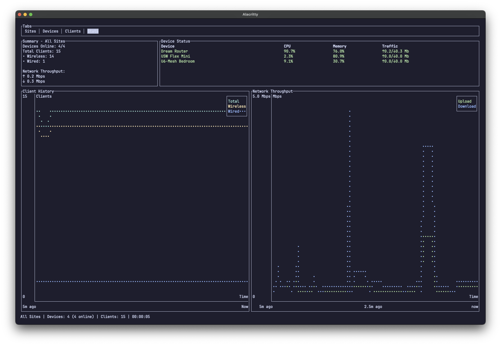

# unifi-tui

[](https://crates.io/crates/unifi-tui)
[](LICENSE)


A terminal user interface (TUI) using the [unifi-rs](https://crates.io/crates/unifi-rs) library for the UniFi Network API.

Currently, a work in progress. Intend to add more features as the unifi-rs library gets more features. 

Can view sites, unifi devices, clients and stats.

## Usage
```shell
unifi-tui --url {url} --api-key {api-key} --insecure
```

Or with environment variables
```shell
export UNIFI_URL={url}
export UNIFI_API_KEY={api-key}

unifi-tui
```

## Screenshots
### Sites


### Unifi Devices


### Clients


### Stats
